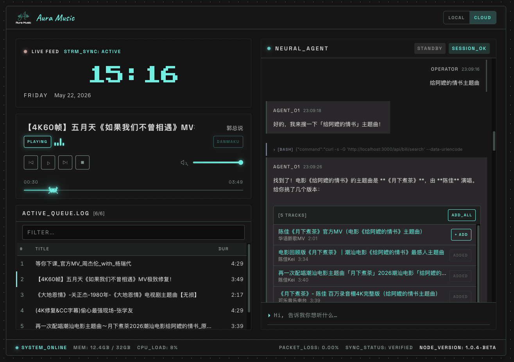

<p align="center">
  
</p>

[](https://creativecommons.org/licenses/by-nc-sa/4.0/)

AI 驱动的智能音乐播放器。随时随地，免费听歌。




## Features

- **AI 对话交互** — 通过自然语言告诉 AI 你想听什么，智能搜索推荐
- **B站海量曲库** — 搜索 B站任意视频，一键转为音频
- **浏览器端转换** — 基于 ffmpeg.wasm，无需服务器，浏览器内完成 AAC→MP3 转换
- **弹幕叠加** — 播放 B站来源的音频时，同步显示原视频弹幕
- **复古终端 UI** — 赛博朋克风格界面，实时状态面板
- **全平台免费部署** — 基于 Cloudflare 免费服务，零成本运行

## Tech Stack

| 层 | 技术 |
|---|------|
| 前端 | Next.js 16 (Static Export) / React 19 / TypeScript 5 |
| 样式 | Tailwind CSS 4 + CSS Variables |
| 后端 | Cloudflare Workers |
| 存储 | Cloudflare R2 (音频) + D1 (元数据) + KV (缓存) |
| AI | OpenRouter 免费模型 (function calling) |
| 转换 | ffmpeg.wasm (浏览器端 AAC→MP3) |

## Getting Started

### 前置条件

- Node.js >= 20
- pnpm（推荐）或 npm
- Cloudflare 账号（免费）
- OpenRouter API Key（免费注册：https://openrouter.ai）

### 安装

```bash
git clone https://github.com/821920046/AirBeat.git
cd AirBeat

# 安装前端依赖
pnpm install

# 安装 Worker 依赖
cd worker && pnpm install
```

### 创建 Cloudflare 资源

```bash
cd worker

# 创建 D1 数据库
npx wrangler d1 create airbeat
# 记下输出的 database_id，填入 wrangler.toml

# 创建 R2 存储桶
npx wrangler r2 bucket create airbeat-audio

# 创建 KV 命名空间
npx wrangler kv namespace create CACHE
# 记下输出的 id，填入 wrangler.toml

# 初始化数据库
npx wrangler d1 execute airbeat --file=../schema.sql --remote

# 设置 OpenRouter API Key
npx wrangler secret put OPENROUTER_API_KEY
```

### 本地开发

```bash
# 终端 1：启动 Worker
cd worker && npx wrangler dev

# 终端 2：启动前端
cd .. && NEXT_PUBLIC_API_BASE=http://localhost:8787 pnpm dev
```

打开 http://localhost:3000 即可使用。

### 部署（Cloudflare 免费方案）

#### 方式一：自动部署（推荐）

Push 到 main 分支后，GitHub Actions 自动部署前端和 Worker。

**首次配置：**

1. **获取 Cloudflare API Token**
   - 打开 https://dash.cloudflare.com/profile/api-tokens
   - 点击 **Create Token** → 选择 **Cloudflare Pages - Edit** 模板
   - 也需勾选 **Account > Workers Scripts > Edit** 权限
   - 创建后复制 token

2. **获取 Cloudflare Account ID**
   - 打开 https://dash.cloudflare.com → 右侧栏可见 **Account ID**

3. **在 GitHub 添加 Secrets**
   - 打开 https://github.com/821920046/AirBeat/settings/secrets/actions
   - 添加两个 Secret：

   | Secret Name | 值 |
   |---|---|
   | `CLOUDFLARE_API_TOKEN` | 上面的 token |
   | `CLOUDFLARE_ACCOUNT_ID` | 上面的 account ID |

4. **首次手动创建资源**（只需一次）
   ```bash
   cd worker
   npx wrangler pages project create airbeat
   npx wrangler d1 create airbeat          # 记下 database_id 填入 wrangler.toml
   npx wrangler r2 bucket create airbeat-audio
   npx wrangler kv namespace create CACHE  # 记下 id 填入 wrangler.toml
   npx wrangler d1 execute airbeat --file=../schema.sql --remote
   npx wrangler secret put OPENROUTER_API_KEY
   npx wrangler deploy                     # 首次部署 Worker
   ```

5. **配置 Pages 路由**
   - Cloudflare Dashboard → Pages → airbeat → Functions → Routes
   - 添加路由：`/api/*` → 指向 Worker `airbeat-api`
   - 添加路由：`/audio/*` → 指向 Worker `airbeat-api`

配置完成后，以后每次 `git push` 到 main 就会自动部署。

#### 方式二：手动部署

```bash
# 部署 Worker
cd worker && npx wrangler deploy

# 构建并部署前端
cd .. && npm run build
npx wrangler pages deploy out --project-name=airbeat
```

## Project Structure

```
AirBeat/
├── app/                     # Next.js 前端（静态导出）
│   ├── components/          # UI 组件（Atomic Design）
│   │   ├── atoms/
│   │   ├── molecules/
│   │   └── organisms/
│   ├── context/             # React Context
│   │   ├── PlayerContext    # 音频播放状态
│   │   ├── AgentContext     # AI 对话状态
│   │   ├── ConvertContext   # ffmpeg.wasm 转换状态
│   │   └── DanmakuContext   # 弹幕状态
│   ├── hooks/               # 自定义 Hooks
│   └── lib/                 # 类型定义 & 配置
├── worker/                  # Cloudflare Worker
│   ├── src/
│   │   ├── handlers/        # API 路由处理
│   │   └── lib/             # B站API / OpenRouter / D1 / CORS
│   ├── schema.sql           # D1 建表语句
│   └── wrangler.toml        # Worker 配置
├── docs/screenshots/        # 应用截图
├── public/                  # 静态资源
└── design/                  # 设计规范文档
```

## Usage

1. 在聊天框输入你想听的内容（如"听周杰伦的晴天"）
2. AI 在 B站搜索并推荐相关结果
3. 点击 + ADD 按钮，浏览器自动下载、转换、上传音频
4. 转换完成后自动加入播放列表，即刻播放

## Platform

| 平台 | 支持情况 |
|------|---------|
| macOS | 完全支持 |
| Linux | 完全支持 |
| Windows | 完全支持（浏览器端转换，无 WSL 依赖） |

## License

本项目采用 [CC BY-NC-SA 4.0](LICENSE) 协议。

你可以自由地查看、修改和分享本项目代码，但 **禁止用于商业用途**。衍生作品须以相同协议分发。
